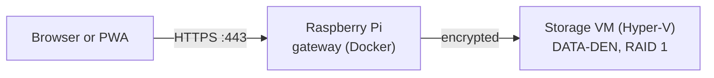

# DATA-DEN

A self-hosted NAS with a web interface to upload, download and manage files:
pictures, documents, videos and more. It installs as an app (PWA) on Android
and Windows.


```mermaid
flowchart LR
    browser["Browser or PWA"] -- "HTTPS :443" --> pi["Raspberry Pi<br/>gateway (Docker)"]
    pi -- "encrypted" --> vm["Storage VM (Hyper-V)<br/>DATA-DEN, RAID 1"]
```

- **Pi:** the only machine reachable from the internet. It terminates HTTPS
  and forwards to the storage VM, nothing else (rpi-setup task `dataden`).
- **Storage VM:** a Debian VM on the Windows PC with both disks passed
  through and mirrored. Windows itself does not see the disks, and only the
  Pi can reach the VM. An optional nightly backup with versioned snapshots
  goes to an external disk or offsite. Setup: [vm/README.md](vm/README.md).
- **DATA-DEN:** this repository, the web interface and its API, as one
  Docker image running in the VM: [deploy/README.md](deploy/README.md).

The server serves the website, `/api/health`, the login, the folder view,
downloads, uploads and a status page.

## Login

The owner's account comes from the settings below. Its password is stored
only as a bcrypt hash:

```bash
cd backend && go run ./cmd/data-den hash-password       # or: docker run --rm -i data-den hash-password
```

Type the password and put the printed hash into the settings, for example a
`.env` next to the compose file (`.env.example` lists them). Put the hash in
single quotes there, `DATA_DEN_PASSWORD_HASH='$2a$12$...'`, or Docker
Compose reads its `$` signs as variables.

| Setting | Meaning |
|---|---|
| `DATA_DEN_USERNAME` | The owner's account name |
| `DATA_DEN_PASSWORD_HASH` | The hash from `hash-password`; without it nobody can log in |
| `DATA_DEN_TRUSTED_PROXY` | The Pi's address; only for requests from it is `X-Forwarded-For` the client's address |
| `DATA_DEN_DATA_DIR` | The data directory, default `/data`; in the storage VM the mirror at `/srv/data-den` |
| `DATA_DEN_TRASH_DAYS` | How many days, 1 to 3650, a deleted item stays in the recycle bin before it is deleted for good; default 30 |
| `DATA_DEN_DISK_WARN_PERCENT` | Warn when less than this share of the disk is free, in percent; default `10` |
| `LISTEN_ADDR` | Where the server listens, default `:8080` |
| `DATA_DEN_TLS_CERT`, `DATA_DEN_TLS_KEY` | Certificate and key in PEM files: with both the server speaks HTTPS, without them plain HTTP |

A login lasts 7 days, in an `HttpOnly`, `Secure`, `SameSite=Strict` cookie;
sessions live in memory, so a restart logs out. After 5 failed logins from
one address within 15 minutes, that address waits until the 15 minutes are
over. Each failed login is logged as `login failed ip=<address>` for
fail2ban on the Pi.

## Accounts

The owner is always an admin. Admins add further accounts in the
**Benutzer** tab: a name (a-z, 0-9, `.`, `-`, `_`), a first password (at
least 10 characters), whether it is an admin too, and a quota in GB (empty
for no limit). They can change the quota and admin role, set a new password
and delete an account later; the owner's account can only be changed in the
settings. In the **Konto** tab everyone sees how much they store of their
quota and changes their own password; a new password logs out the other
devices.

Each account has its own space and sees no one else's files. The owner's
space is the data directory itself, so the files from before there were
accounts stay where they are; every other account gets
`.data-den-users/<name>` in it, which the owner never sees. The recycle bin
counts towards the quota, thumbnails do not. The search, the recycle bin
and the share links work within each account's own space. An upload that would go over
the quota is refused before it starts. Deleting an account moves its folder
to `.data-den-users/.deleted/<name>-<time>`, so its files can still be
recovered in the VM.

The accounts are kept in `.data-den-accounts/accounts.json` in the data
directory, readable only by the server, with bcrypt hashes of the passwords.

### Two-factor login

Each account can turn on a second factor for itself in the **Konto** tab:
scan the QR code with an authenticator app (Aegis, Google Authenticator,
2FAS and the like), type the code it shows, and note the ten recovery codes
shown once then. From then on the login also asks for the app's code
(TOTP, 6 digits, 30 seconds); a recovery code works instead, once each.
Wrong codes count as failed logins. Turning it off again needs the password
and a code.

When someone loses the phone and the recovery codes, an admin turns it off
for that account in the **Benutzer** tab. The owner's own is turned off in
the VM, with the server stopped:

```bash
sudo docker compose stop data-den
sudo docker compose run --rm data-den reset-2fa <username>
sudo docker compose start data-den
```

The secrets are stored in the accounts file, the recovery codes only as
SHA-256 hashes.

### App passwords

Scripts, apps and network drives should not use the account's password and
second factor. Each account creates app passwords for them in the **Konto**
tab, with a name, optionally read-only and with an end date, confirmed with
the password. The token (`dd_` and 43 characters) is shown once; the server
keeps only its SHA-256 hash. Send it as a header, or with Basic auth as the
password next to the account's username (curl asks for it with `-u <username>`):

```bash
curl -H "Authorization: Bearer $DATA_DEN_TOKEN" https://<host>/api/files
```

It works for everything a login can do with files, but not for the
account's settings (password, 2FA, app passwords) or for managing accounts.
A read-only one only reads (GET and HEAD). Each can be revoked in the
**Konto** tab; an admin can revoke all of an account's in the **Benutzer**
tab, and deleting an account revokes its own. Wrong tokens count as failed
logins.

### Audit log

The **Protokoll** tab shows who did what, when and from which address:
logins (also failed ones and wrong codes), logouts, password and 2FA
changes, accounts created, changed or deleted, and changes to files
(uploads, new folders, moves and renames, the recycle bin) and share links
(created, deleted, files fetched through a link, wrong link passwords).
Admins see everyone's entries and can filter by user; everyone else sees
their own. Viewing and downloading within one's own space is not logged.

The log is `.data-den-audit/audit.log` in the data directory, one JSON line
per entry, readable only by the server. At 5 MB it moves to `audit.log.1`,
replacing the older one, so the latest 5 to 10 MB are kept.

## Files

After the login the website has four tabs. **Dateien** shows the folders of
the data directory, with a path bar to go back up; a click on a photo, video,
song, PDF or text file opens it in the viewer, other files and the ⬇ link
download it. **Fotos** shows every photo as a timeline by the month it was
taken, with a row of years to jump to, **Videos**
every video, **Dokumente** every document with its folder; all newest first,
with a search over the path and 120 at a time. The viewer goes through the
list with ‹ › or the arrow keys, plays videos with seeking, shows PDFs in a
frame and text files up to 1 MB, and closes with Escape. Downloads can be
resumed (HTTP range requests), which matters for large videos. Every access
goes through Go's `os.Root`, so neither `..` nor a symlink reaches anything
outside the data directory; symlinks are not listed at all. In Docker the
server runs as user 65532, so the data directory has to belong to it:
`sudo chown -R 65532:65532 /srv/data-den`.

Photos, videos, music and documents get their own views. `/api/view` serves
a file for the browser to show, with range requests so a video can seek; it
only takes the formats listed in `backend/internal/files/view.go` (images,
MP4/WebM/MOV/MKV, common audio, PDF and plain text), never HTML, and serves
everything but PDFs in a CSP sandbox. Other files, such as Word or Excel
documents, are downloaded. `/api/media?kind=photo|video|audio|document` lists
every file of that kind in the whole data directory, newest first. Photos
come with `taken` (from the EXIF date, in the camera's local time, such as
`2026-07-14T15:32:10`) and `lat`/`lon` (from the EXIF GPS data) and are sorted
by `taken`, or by the file's time when a photo has no date. Only JPEGs carry
EXIF that is read; it is read once per photo and kept in memory until the
photo changes, ahead of time by the search index's walk.

The gallery shows thumbnails from `/api/thumb`: a JPEG of at most 320 pixels,
made from JPEG, PNG, GIF, WebP and BMP photos up to 100 megapixels, turned by
the photo's EXIF orientation. The first request makes it, two at a time, and
keeps it in `.data-den-thumbs/` in the data directory, hidden like
`.data-den-uploads/`; a changed photo gets a new one. Other photos, such as
HEIC, are shown as they are. Thumbnails of deleted photos stay; deleting
`.data-den-thumbs/` is safe and only costs making them again.

In the folder view, **Neuer Ordner** creates a folder in the open folder;
each row can be renamed (✎), moved (↪: open the target folder, then
**Hierher verschieben**) and deleted (🗑). The API is
`POST /api/folders {"path"}`, `POST /api/move {"from", "to"}` and
`POST /api/delete {"path"}`, JSON only.

Deleting moves the file or folder into the recycle bin,
`.data-den-trash/` in the data directory (hidden; a rename, so quick even for
large folders), and the folder view offers **Rückgängig** right away. The
**Papierkorb** tab lists what was deleted, where it was and until when it
stays; each item can be restored to its old place (its folder is made again
if needed, an item already there is never overwritten) or deleted for good,
and the whole bin emptied. After 30 days (`DATA_DEN_TRASH_DAYS`) an item is
deleted for good, checked at start, every hour and whenever the bin is opened. API: `GET /api/trash`,
`POST /api/trash/restore {"id"}`, `POST /api/trash/delete {"id"}`,
`POST /api/trash/empty {}`. Nothing is ever overwritten by accident
("Existiert bereits"), a folder cannot move into itself, and the data
directory itself and the `.data-den-*` folders cannot be changed.

File versions: an upload onto an existing file stops with **existiert
schon** and asks: **Ersetzen**, **Überspringen**, or **Alle ersetzen**.
Replacing keeps the old content as a version in `.data-den-versions/`
(hidden; a hard link, then a rename, so the file is never half written).
**Ältere Versionen** (🕘 on a file's row) lists them with the time of the
content and of the replacement; each can be downloaded, restored (the
content it replaces becomes a version itself, so nothing is lost) or
deleted. A file keeps its 10 newest versions, each for 30 days, checked at
start and every hour; versions follow the file when it is moved or renamed
and count towards the account's quota. API: `POST /api/uploads` with
`"replace": true`, `GET /api/versions?path=`,
`GET /api/versions/download?path=&id=`, `POST /api/versions/restore {"path", "id"}`,
`POST /api/versions/delete {"path", "id"}`.

The search field above the tabs looks through everything at once and lists
the hits with their folder, the searched words marked; a click opens a file
in the viewer, or its folder in **Dateien** when the browser cannot show it.
`GET /api/search?q=` searches the names and paths of all files and folders
and the text of documents: TXT, MD, CSV and LOG (UTF-8 or Latin-1), PDF,
Word (`.docx`) and OpenDocument (`.odt`). Every word must match; a match in
the name ranks above one in the path, which ranks above one in the text,
and a text match comes with a snippet around it. The index lives in memory:
built in the background at start and refreshed every 10 minutes, reading
again only files whose size or modification time changed. Of each document
up to 50 MB, the first 256 KB of text are indexed. The recycle bin and the
other `.data-den-*` folders are left out.

Share links (🔗 on a row) give a file or folder to people without a login:
the link `/s/<id>` works for 1, 7, 30 or 90 days or a year and can ask for a
password. Behind it, a shared folder can be browsed, each file downloaded
and any folder in it downloaded as one ZIP (stored, not compressed, so it
starts at once); nothing outside the shared folder is reachable, not even
through symlinks. A wrong password counts like a failed login (same lockout,
same `login failed` log line for fail2ban, with `share=<id>`); the right one
sets a cookie for that one link, valid for a day at most. The **Freigaben**
tab lists the links, until when they work and whether they need a password,
copies a link again and revokes it. Moving or renaming keeps the links
working; in the recycle bin, the link stops working until it is restored.
Expired links answer like unknown ones and are removed. Each link is a file
in `.data-den-shares/` in the data directory (hidden), with the password as
a bcrypt hash. API: `GET /api/shares`,
`POST /api/shares {"path", "days", "password"}`,
`POST /api/shares/delete {"id"}`; for the link `GET /api/s/{id}`,
`POST /api/s/{id}/unlock {"password"}`, `GET /api/s/{id}/files?path=`,
`GET /api/s/{id}/download?path=` and `GET /api/s/{id}/zip?path=`.

Every file gets a SHA-256 checksum, kept in `.data-den-sums/index.json` in
the data directory (hidden like the other `.data-den-*` folders; deleting it
is safe and only costs reading every file again). An upload's checksum is
taken from the bytes as they arrive, and the last chunk's answer lists the
files that already have the same content, which the upload list shows.
Every hour the server walks the data directory: new and changed files (other
size or time) get a checksum, and every file is read again at least every
30 days. A file whose content changed while its size and time did not is
damaged on the disk: RAID 1 keeps both disks equal, not correct. The log
says so as an error, and the **Prüfung** tab lists it; once the file is put
back from a copy, or looked at and found fine, **Als richtig übernehmen**
takes its content as it is. The same tab starts a check of every file now,
shows its progress, and lists the duplicates, most space to gain first, each
with 🗑 to move one into the recycle bin. Moves and the recycle bin keep the
checksums. Each account has its own checksums and sees only its own
duplicates; the checks of all accounts read one file at a time. API:
`GET /api/duplicates`, `GET /api/integrity`,
`POST /api/integrity/check {}`, `POST /api/integrity/accept {"path"}`.

Uploads take many files or whole folders at once, picked with the two
buttons or dragged onto the page, into the open folder. Three files upload
at a time, each with its own progress bar. Every file goes in chunks of
8 MB (`/api/uploads`); a failed chunk is sent again from where the server
stands, so a broken connection costs at most one chunk. Folders in the path
are created, and an existing file is never overwritten: the upload stops
with "Datei existiert bereits". Unfinished chunks wait in
`.data-den-uploads/` in the data directory, which the folder view hides; a
restart of the server removes them.

## Desktop sync

`data-den-sync` keeps a folder on a PC and a folder in DATA-DEN the same,
both ways, like a sync client: a file changed, added or deleted on either
side follows on the other, over the same HTTPS address as the website. It
is built for Windows (x64 and ARM) into the image; download it while logged
in from `https://<address>/api/sync/client/data-den-sync-windows-amd64.exe`
(or `-arm64.exe`), or build it with
`cd backend && GOOS=windows go build ./cmd/data-den-sync`.

```powershell
.\data-den-sync.exe setup            # address, app password, folder on the PC, folder in DATA-DEN
.\data-den-sync.exe run              # syncs now and every minute; Ctrl+C stops
.\data-den-sync.exe autostart on     # starts "run --hidden" at every login, for this user only
```

It logs in with an app password, never the account's password; on Windows
the password is kept encrypted for that Windows user (DPAPI), elsewhere in a
file only the user can read, or comes from `DATA_DEN_SYNC_TOKEN`. Settings
and the log (`sync.log`) are in `%AppData%\DATA-DEN-Sync`; `interval` in
`config.json` sets the seconds between rounds (default 60).

Each round lists both sides (`GET /api/sync/tree?path=`, every file with its
size, time and checksum) and compares them with the state after the last
round, kept in `.data-den-sync\state.json` in the synced folder:

- Changed on one side: copied to the other. A file the server replaces is
  kept as a version, one it deletes goes into its recycle bin; one deleted
  on the PC is moved to `.data-den-sync\deleted\<day>` and removed after
  30 days.
- Changed on both sides: the PC's version becomes
  `name (Konflikt <date> <PC>).ext` and is uploaded too, so nothing is
  lost; the server's version keeps the name. Equal content is no conflict.
- Deleted on one side, changed on the other: the change wins.
- A folder deleted on one side is deleted as a whole on the other, unless
  something in it changed there.

The server replaces or deletes a file only while it is still as the round saw
it (`"replace": true, "expect": {"size", "mod"}` on `POST /api/uploads`,
`"size"` and `"mod"` on `POST /api/delete`, otherwise 412), so an edit from another device in the
meantime waits for the next round instead of being overwritten. If one side
is suddenly empty while both had files, such as a missing drive, the client
stops instead of deleting everything. Names Windows cannot hold (`:`, `?`,
`CON` and the like) and names that differ only in case are left out with a
line in the log; `desktop.ini`, `Thumbs.db`, `~$` Office lock files and
`.tmp` files are never synced.

## Status

The **Status** tab shows the free space on the data disk, the state of the
RAID and how long the server and the VM have been up. `GET /api/status`
(behind the login) reads the space with `statfs` on the data directory and
the RAID from `/proc/mdstat`, which a container shares with its VM. When less
than `DATA_DEN_DISK_WARN_PERCENT` (10 %) of the disk is free, or a disk of
the mirror is missing, every page shows a warning; below a quarter of that
(2.5 %) the warning says the disk is almost full. The web interface checks
every 5 minutes while someone is logged in. Outside the VM there is no RAID,
and the page says so. `/api/health` stays as it is, without login, for
Docker's health check.

## Development

Needs Go (version in `backend/go.mod`) and Node (version in
`frontend/.nvmrc`).

```bash
cd frontend && npm ci && npm run build   # builds the website into the backend
cd ../backend && DATA_DEN_USERNAME=me DATA_DEN_PASSWORD_HASH='<hash>' go run ./cmd/data-den   # http://localhost:8080
```

For live reload of the website, run `npm start` in `frontend/` next to the
backend: `http://localhost:4200`, with `/api` passed to the backend.

Checks, as CI runs them:

```bash
cd backend && gofmt -l . && golangci-lint run && go test ./...
cd frontend && npm run format:check && npm run lint && npm test && npm run build
```

With Docker:

```bash
docker build -t data-den .
docker run --rm -p 8080:8080 data-den
```

## CI

Every pull request runs the shared checks of
[repo-base](https://github.com/Programmer-Den/repo-base) (secrets, links,
PR template), the Go and Angular jobs, and builds the image for amd64 and
arm64. They run on the light self-hosted runners once those are set up
([runner/README.md](runner/README.md)), otherwise on GitHub's runners.

Contributions follow [AGENTS.md](AGENTS.md); security issues go to
[SECURITY.md](SECURITY.md).
